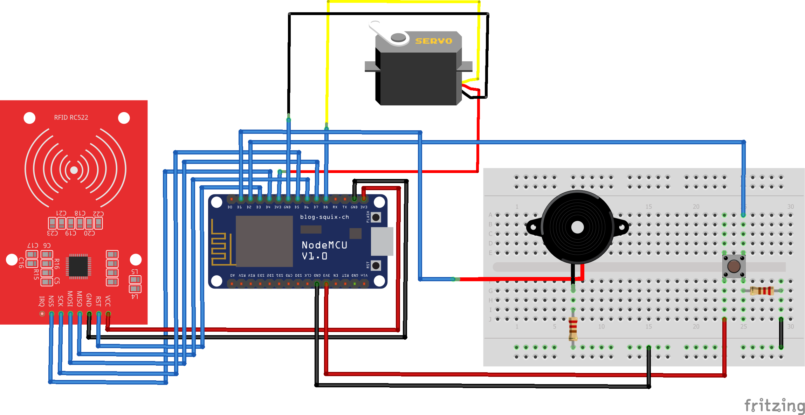

# Web Based E-Tag Attendance System

## Structure

- Description
- Tasks
- Components
- Circuit Diagram
- Raspbaerry Pi
- References

## Description

As a part of our University Curriculum, we made this project for Embedded Systems - CSCS 306. In this project, we used the RFID card to unlock a barrier. We simulated the barrier using a servo motor by pasting a lightweight straw with the servo. Whenever the person with the matching RFID approaches the barrier, the system lifts the barrier by making servo motor to rotate and lowering it after 30 seconds. We also connected a failsafe button that raises and lowers the barrier manually. The barrier raises and remains in that position if the button is pressed and lowers when the button is released. This mechanism overrides the presence/absence of an RFID card. We also had to add web-based functionalitiesto simulate a kind of a web-based attendance system.

## Tasks

### Task 1:
Apart from raising and lowering the barrier, the system identifies a legal RFID card. It also produces a beep if an unregistered card is swiped. Every card is linked to a person (may be a student or staff member). The system is able to identify both. We created a database on Ubuntu Server and a table for the users and also another table that has a relationship to the first table. Once the user swipes her card, information such as date and time is stored in the database signifying the attendance. Moreover, we created a web page that could be used to retrieve attendance information about a particular user.

### Task 2:
This task is the exact replica of Task 1. Only difference is that now we implemented the Server functionalities on a Raspberry Pi 3. We had to execute various steps in an orderly manner which are mentioned under Raspberry Pi heading.

## Components

- NodeMCU Amica
- RFID Card Reader Writer Module
	- VCC (Supplies power for the module, typically 3.3V is used)
	- RST (Reset pin - used to reset or power down the module)
	- GND (Ground Pin and needs to be connected to the GND pin on the Arduino)
    - IRQ (Interrupt pin that can alert the microcontroller when RFID tag comes into its vicinity)
	- MISO/SCL/Tx (MISO pin when used for SPI communication, acts as SCL for I2c and Tx for UART)
	- MOSI (Master Out Slave In - is SPI input to the RC522 module)
	- SCK (Serial Clock pin - used to provide clock source)
	- SS/SDA/Rx (Acts as Serial input (SS) for SPI communication, SDA for IIC and Rx during UART)
- Servo Motor
	- VCC (Typically red and needs to be connected to the 5V pin on the Arduino)
	- GND (Typically black or brown and needs to be connected to the GND pin on the Arduino)
	- Signal (Typically yellow, orange or white and needs to be connected to a digital pin on the Arduino)
- Buzzer
	- Positive (Identified by (+) symbol or longer terminal lead. Can be powered by 6V DC)
	- Negative (Typically connected to the ground of the circuit)

## Circuit Diagram

<p align="center">
    
</p>

## Raspberry Pi

The headless setup using WiFi needs an SD card and power supply only. It provides access of Keyboard, Mouse and Screen to your Raspberry Pi without the need for an external setup.

### Components Required:
- Hardware
	- Raspberry Pi 3/Pi 4/ Pi Zero W
	- 16 GB SD Card
- Software
	- Raspbian OS (https://www.raspberrypi.org/downloads/raspbian/)
	- SD card formatter (https://www.sdcard.org/downloads/formatter_4/)
	- Win32 Disk Imager (https://sourceforge.net/projects/win32diskimager/)
	- Advanced IP Scanner (http://www.advanced-ip-scanner.com/index2.php)
	- Putty SSH (https://www.putty.org/)
	- Real VNC Viewer (https://www.realvnc.com/en/connect/download/viewer/)

### Raspbian OS Installation

1. Download **Raspbian Buster with desktop and recommended software** .zip file. This will contain a Raspbian image file.

2. Format the SD card with **SD card formatter**.

3. After formatting, open **Win32 Disk Imager**, locate the downloaded Raspbian image file and flash it to the SD Card.

4. After flashing open SD Card and create `wpa_supplicant.conf` file and empty `ssh` file with no extension. Both files should be created in the root of the SD Card.

5. Now open `wpa_supplicant.conf` file using any text editor and paste the following code:

	```
	ctrl_interface=DIR=/var/run/wpa_supplicant GROUP=netdev
	update_config=1
	country=PK
	
	network={
	ssid="SSID"
	scan_ssid=1
	psk="Password"
	key_mgmt=WPA-PSK
	}
	```

	**Note:** Modify the “SSID” and “Password” with your WiFi Credentials.

6. Insert SD Card in the appropriate slot and power on the Raspberry Pi, wait for a few seconds until it boots. The Laptop and Raspberry Pi Should be connected to the same WiFi network. Wait for 30 seconds until Pi boots up and connects to your WiFi Network. Then open **Advanced IP scanner** software that you installed on your Laptop. Then click Scan. This will show up all the devices connected to the router in this range. You can Identify the Pi’s IP by the Manufacturer name. Note down the Raspberry Pi’s IP address. This is a proof that the OS has been successfully installed.

### Headless Connection

1. Now open **Putty** and put Raspberry Pi IP address we found using Advanced IP Scanner in the Host Name (or IP Address) field and click the Open button.

2. Now the terminal window will open (Click yes on security warning) then enter Pi username and password. The default username and password are
Username: pi
Password: raspberry

3. After logging in type `sudo raspi-config` and hit enter.

4. In the GUI navigate to **Interfacing options**. Then navigate to **VNC** and enable it. Click Finish and exit the wizard.

5. Type `vncserver` on the terminal window and hit enter.

6. Now, **Open Real VNC** software that you installed and type Pi’s IP address, then click enter.
Example: `192.168.43.164`
or
`raspberrypi.local`

	In some cases you might need to add a `:1` at the end of IP or hostname.
	Example: `192.168.43.164:1`  or  `raspberrypi.local:1`

	Login with Pi username and password. The default username is ‘pi’ and the password is ‘raspberry’. Accept the security warning. Now the Pi Desktop window will show up. That’s it, now you can access your pi over WiFi without cables. Just a power supply is enough.

### LAMP Stack Configuration:
1. Before starting the installation procedure, open a Terminal window and run the following commands to update your Pi:

		sudo apt update && sudo apt upgrade -y

2. To install Apache2 on your Raspberry Pi, run the next command:

		sudo apt install apache2 -y

	That’s it! Apache is now installed. To test your installation, change to the `/var/www/html` directory and list the files:

		cd /var/www/html
		ls -al

	You should have an index.html file in that folder. To open that page in your browser, you need to know the Raspberry Pi IP address, so use the following command:
	
		hostname -I

	If you open your RPi IP address in any browser in your local network, you should get an Apache2 Debian Default Page.

3.	To install PHP on Raspberry Pi, run:

		sudo apt install php -y

	You can remove the index.html and create a PHP script to test the installation:

		sudo rm index.html
		sudo nano index.php
	
	In your index.php file add the following code to echo the “hello world” message:
	
		<?php echo "hello world"; ?>

	To save your file: press `Ctrl+X`, followed by `y`, and press Enter to exit.

	Finally, restart Apache2:
	
		sudo service apache2 restart

	To test if Apache2 is serving .php files, open the Raspberry Pi IP address and it should display the “hello world” message from the index.php script created earlier. If everything is working, you can remove index.php file from the `/var/www/html` directory:

		sudo rm index.php

4.	Install the MySQL Server (MariaDB Server) and PHP-MySQL packages by entering the following command:

		sudo apt install mariadb-server php-mysql -y
		sudo service apache2 restart
	
	After installing MySQL (MariaDB Server), it’s recommended to run this command to secure your MySQL installation:

		sudo mysql_secure_installation

	- You will be asked Enter current password for root (type a secure password): press Enter
	- Type in `Y` and press Enter to Set root password
	- Type in a password at the New password: prompt, and press Enter.

		**Note:** remember this root password, as you will need it later
	- Type in `Y` to Remove anonymous users
	- Type in `Y` to Disallow root login remotely
	- Type in `Y` to Remove test database and access to it
	- Type in `Y` to Reload privilege tables now
	When the installation is completed, you’ll see the message: “Thanks for using MariaDB!”.

## References
- https://www.arduino.cc/en/Tutorial/WhileStatementConditional
- https://randomnerdtutorials.com/security-access-using-mfrc522-rfid-reader-with-arduino/
- https://diygeeks.org/learn/servo-motor-with-arduino/
- https://www.arduino.cc/en/Tutorial/WhileStatementConditional
- https://randomnerdtutorials.com/security-access-using-mfrc522-rfid-reader-with-arduino/
- https://diygeeks.org/learn/servo-motor-with-arduino/
- https://create.arduino.cc/projecthub/SURYATEJA/use-a-buzzer-module-piezo-speaker-using-arduino-uno-89df45
- https://github.com/dancol90/ESP8266Ping
- https://circuits4you.com/2018/03/10/esp8266-nodemcu-post-request-data-to-website/
- https://stackoverflow.com/questions/15461765/check-if-username-exist-activated-in-database-using-mysqli
- https://www.w3schools.com/php/func_mysqli_fetch_assoc.asp
- https://github.com/esp8266/Arduino/blob/master/doc/boards.rst#pin-mapping
- https://github.com/ThingPulse/esp8266-weather-station-color/issues/15
- https://www.restapitutorial.com/httpstatuscodes.html
- https://fritzing.org/

# Contributors

Do check the contributor to follow some awesome projects

- [@mohammadusman666](https://github.com/mohammadusman666)
- [@abeer04](https://github.com/abeer04)

`Feel free to fork the repository and contribute to this project.`
